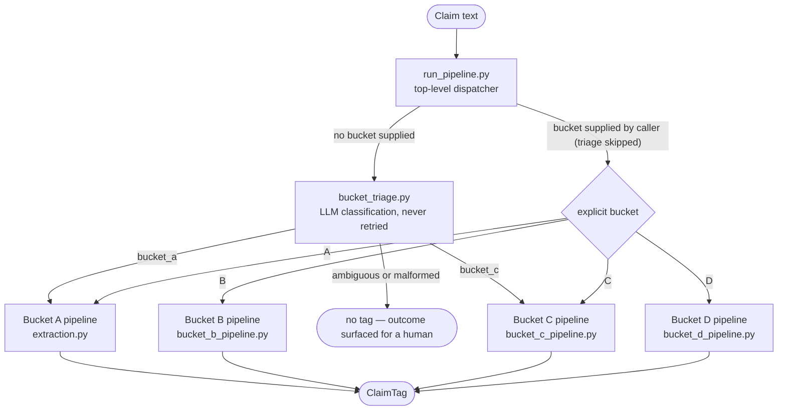
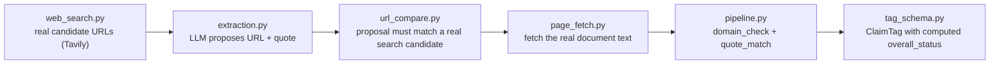

# Architecture

How the system is structured and why the structure looks the way it does. This document describes the shape of the system; the reasoning behind each individual decision — including rejected alternatives and the real bugs that drove changes — lives in [DESIGN_DECISIONS.md](DESIGN_DECISIONS.md) and is linked throughout.

## The core principle

Every design choice traces back to one thesis, stated in full in the [Design Decision Record](DESIGN_DECISIONS.md): **a check only counts if it would have given a different answer in the world where the claim was false.** A model re-asserting its own output is not a check. The architecture therefore separates the parts that *propose* (LLM calls) from the parts that *verify* (deterministic code checking proposals against real, independently fetched primary sources), and reserves genuine judgment for humans.

## The claim taxonomy

Claims are classified into four buckets, each with a different verification mechanism because they are different *kinds* of claim:

| Bucket | Type | How it's checked |
|---|---|---|
| **A** | Source verification — a single authoritative source exists (a press release, a TPI score, a regulatory filing) | Deterministic: domain check + quote match against the real document |
| **B** | Framework alignment — judgment against NZIF or TPI criteria | Evidence gathered for human review — never automated |
| **C** | Definition disambiguation — definitionally fuzzy claims (e.g. market share) where "the answer" depends on scope | Multiple sources gathered, definitions reconciled |
| **D** | Reasoning transparency — counterfactual or forward-looking claims, uncheckable by definition | Assumptions and causal chain surfaced for human review |

Why the taxonomy is defined by *whether a single authoritative source exists in principle*, not by how a claim is phrased, is worked through with real counterexamples in [Designing Bucket C](DESIGN_DECISIONS.md#designing-bucket-c--re-deriving-the-original-taxonomy-from-a-real-example-before-writing-any-code).

## Claim routing

`run_pipeline.py` is the single entry point. It routes a claim through triage (or an explicit, caller-supplied bucket) into the right pipeline, and always returns the same four-field dict (`outcome`, `bucket`, `triage_reasoning`, `tag`) regardless of which pipeline ran or whether triage failed.

Two routing rules are deliberate, not omissions:

- **Triage never routes to Bucket B.** Framework alignment requires a human to identify which framework applies and which criteria to check — triage has no basis for that from claim text alone. Bucket B always requires explicit `bucket="B"` from the caller. ([why](DESIGN_DECISIONS.md#run_pipelinepy--the-top-level-dispatcher-and-the-decisions-that-shaped-it))
- **Triage never routes to Bucket D.** At current project scale, a human identifies counterfactual/forward-looking claims before the pipeline runs. ([why](DESIGN_DECISIONS.md#bucket_d_analysispy-and-bucket_d_pipelinepy--surfacing-reasoning-structure-for-unverifiable-claims))

## The Bucket A verification chain

Bucket A is the fully automatable case and shows the propose/verify separation most clearly. The LLM only ever *proposes* (a URL from real search candidates, a supporting quote); every proposal is then checked deterministically against ground truth the model did not choose:

The loop in `extraction.py` retries up to a hard cap of 3, stopping early when repeated attempts show no measurable progress — and if search returns zero results, the LLM is never called for that attempt (the [no-fallback rule](DESIGN_DECISIONS.md#extractionpy--the-one-place-a-real-model-gets-called-and-why-everything-else-stays-untouched)).

## Layering principles

**Generic modules know nothing about companies, claims, or buckets.** `domain_check.py`, `quote_match.py`, `url_compare.py`, `page_fetch.py`, `web_search.py`, and `log_utils.py` are deliberately generic so the same function works for any claim against any document. This is what let Buckets B, C, and D reuse them as building blocks instead of reimplementing them.

**LLM proposals are always verified where ground truth exists.** Every excerpt an LLM proposes is checked via `quote_match` against the real fetched document; every URL via `url_compare` against real search candidates. Where no ground truth exists (triage classification, Bucket D's reading of a claim), the LLM's output is validated for *form* only, and the substantive judgment is explicitly left to a human — no module ever lets a model grade its own output. ([why](DESIGN_DECISIONS.md#bucket_d_analysispy-and-bucket_d_pipelinepy--surfacing-reasoning-structure-for-unverifiable-claims))

**Anchoring inputs are explicit parameters, never inferred.** `company_name`, `allowlist`, and the document under test are always caller-supplied. If the model chose them, a hallucinated source could validate itself. ([why](DESIGN_DECISIONS.md#bucket_b_pipelinepy--the-orchestrator-and-the-bug-only-a-live-run-could-find))

**Failures are named, never collapsed.** Distinct failure mechanisms get distinct statuses (`numeric_mismatch` vs `no_match`, `company_not_in_tpi_universe` vs a transient fetch failure, `unresolved` vs `failed_reconciliation`) because they carry different diagnostic and review implications.

**`overall_status` is computed, never settable.** `ClaimTag.overall_status` is a read-only property recomputed from the attached evidence, so "verified" can never be asserted without the evidence that makes it true. ([why](DESIGN_DECISIONS.md#tag_schemapy--what-does-verified-actually-mean-and-whos-allowed-to-say-it))

## Module map

| Layer | Module | Role |
|---|---|---|
| Deterministic checks | `agent_eval/domain_check.py` | URL hostname vs a per-company allowlist |
| | `agent_eval/quote_match.py` | Fuzzy quote matching with an exact numeric token gate and an ambiguity-gap rule |
| | `agent_eval/url_compare.py` | Same-page URL comparison — cosmetic differences tolerated, path exact |
| | `agent_eval/page_fetch.py` | URL → plain text (HTML and clean PDFs), size caps, honest named failures |
| | `agent_eval/tpi_extract.py` | Deterministic TPI Management Quality parser (raw HTML, no LLM) |
| Schema & presentation | `agent_eval/tag_schema.py` | `ClaimTag` and typed evidence dataclasses; computed `overall_status` |
| | `agent_eval/serialisation.py` | Round-trip `ClaimTag`/result ↔ plain JSON |
| | `agent_eval/review.py` | Terminal formatter for `ClaimTag` and pipeline result output |
| LLM-calling modules | `agent_eval/extraction.py` | Bucket A loop: LLM selects URL + quote from real search results, with retry-with-feedback |
| | `agent_eval/criterion_evidence.py` | Bucket B: per-criterion NZIF excerpt finding; holds the hand-transcribed `NZIF_CRITERIA` and `NZIF_CRITERION_TIERS` |
| | `agent_eval/bucket_triage.py` | Bucket A vs C classification from claim text alone; "ambiguous" is never retried |
| | `agent_eval/source_extraction.py` | Bucket C: per-source value/definition extraction, each independently verified |
| | `agent_eval/reconciliation.py` | Bucket C: grouping sources by shared definition (one whole-list call) |
| | `agent_eval/bucket_d_analysis.py` | Bucket D: structured partial reading of assumptions and causal steps — no verdict |
| Orchestration | `agent_eval/pipeline.py` | Bucket A single-claim wiring (deterministic; no LLM call) |
| | `agent_eval/bucket_b_pipeline.py` | Bucket B orchestrator: six criteria, independent chains, in-call fetch cache |
| | `agent_eval/bucket_c_pipeline.py` | Bucket C orchestrator: triage → source gathering → reconciliation |
| | `agent_eval/bucket_d_pipeline.py` | Bucket D orchestrator |
| | `agent_eval/run_pipeline.py` | Top-level dispatcher |
| External services | `agent_eval/web_search.py` | Tavily search wrapper — generic, knows nothing about claims |
| | `agent_eval/llm_client.py` | Provider seam: the one place the concrete LLM (OpenAI) is named; every LLM-calling module depends on the `LLMClient` interface, not the SDK |
| Support & data | `agent_eval/log_utils.py` | Shared JSONL append helper for the evaluation log |
| | `agent_eval/ground_truth.py` | Primary-source verified claims and metadata for 9 companies (used by live tests, not imported by pipeline modules) |
| | `agent_eval/adversarial_eval.py` | Deterministic self-evaluation: feeds the Bucket A verifier corrupted proposals and asserts each is caught with the correct status |
| Results layer | `scripts/run_batch.py` | Batch runner producing `data/results.json` |
| | `scripts/adversarial_eval.py` | CLI runner for the verifier self-evaluation (offline, CI-gated) |
| | `index.html` | Single-file, no-build results browser reading `data/results.json` |

## Status vocabulary

Each bucket has its own terminal success status, deliberately distinct words because they make different claims about what was established:

| `overall_status` | Bucket | Meaning |
|---|---|---|
| `verified` | A | Both deterministic checks passed against the real document — reserved for this case only |
| `source_illegitimate` | A | The domain check failed, regardless of how well the quote matched |
| `criteria_evidence_gathered` | B (NZIF) | Real, verified excerpts gathered for human judgment — never an automated verdict |
| `tpi_data_fetched` | B (TPI) | Direct deterministic fetch; no AI claim or check anywhere in the chain |
| `conflicting_evidence_types` | B | Guard: NZIF and TPI evidence both set on one tag, which should never happen |
| `disambiguated` | C | At least one real multi-source definition group exists |
| `definitional_ambiguity_unresolved` | C | No supportable consensus value for the claim |
| `assumptions_explicit` | D | At least one stated assumption and one stated causal step are visible in the claim |
| `assumptions_not_stated` | D | The claim shows no explicit reasoning |
| `incomplete` | any | Required evidence for the bucket is missing |

Why none of the B/C/D success states reuse the word "verified" is covered in [tag_schema.py's design record](DESIGN_DECISIONS.md#tag_schemapy--what-does-verified-actually-mean-and-whos-allowed-to-say-it) and the [TPI status discussion](DESIGN_DECISIONS.md#tpi_extractpy--adding-tpi-management-quality-and-a-real-architectural-fork-found-by-refusing-to-settle-for-treat-it-as-fixed).

## Logging

All four buckets write structured entries to one shared file, `logs/evaluation_log.jsonl`, via `log_utils.py`. Every entry carries `company_name` and `bucket` as top-level fields so cross-bucket, cross-company history is queryable without merging files. Granularity is one entry per attempt (Bucket A) or per criterion/call (B, C, D), each with a `stage_reached` field — chosen because that granularity proved sufficient for diagnosing every real live failure. The log's explicit purpose is to let a human independently judge whether a status was actually correct, not just trust the system's own verdict. ([why](DESIGN_DECISIONS.md#unifying-logging-across-both-buckets--a-real-gap-noticed-not-invented))

`logs/` is gitignored: entries may contain real company names, claim text, and evidence excerpts from live runs.

## Testing model

Two deliberately different test classes, because they catch different classes of error and neither substitutes for the other ([the evidence](DESIGN_DECISIONS.md#cross-cutting-lessons)):

- **Deterministic suite** (`python -m pytest -m "not live_api" -q`) — 320 tests, no network, every LLM injected as a fake. Proves the logic is internally consistent with its own assumptions.
- **Live tests** (`RUN_LIVE_API=1 python -m pytest -m live_api -v`) — real search, real pages, real models, real cost. Proves the assumptions about the outside world are actually correct. Three of the project's most consequential bugs were findable only this way.
