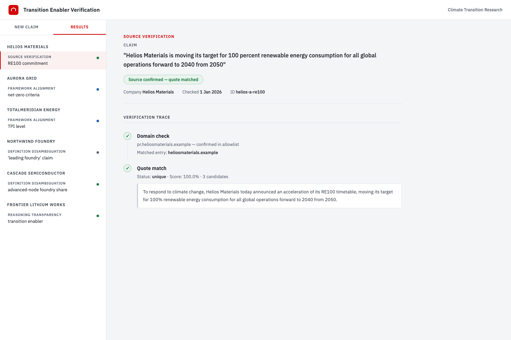

# Claim Verification Pipeline

[](https://github.com/matt-huang1/claim-verification-pipeline/actions/workflows/ci.yml)
[](.github/workflows/ci.yml)
[](LICENSE)
[](pyproject.toml)

A verification layer for AI-assisted climate transition research at an asset manager. Its job is to catch errors before they reach client documents - specifically, cases where a model produces plausible-sounding claims not grounded in primary sources. Every URL, quote, and figure a model proposes is checked deterministically against independently fetched primary sources before anything is called verified.

> **Independent project.** This is a personal portfolio project, built and maintained solely by me. It is not affiliated with, endorsed by, or produced on behalf of any employer or client. "An asset manager" refers generically to the professional context that motivated the work; no client is named, and the repository contains no confidential, proprietary, or otherwise non-public information. Every claim and data point is verified against publicly available primary sources - company disclosures and the public [NZIF](https://www.iigcc.org/hubfs/2023%20resources%20updates/NZIF%202.0.pdf) and [TPI](https://www.transitionpathwayinitiative.org/) frameworks.

**The founding failure:** an earlier AI-assisted assessment of TSMC used a framework classification label that does not exist in the IIGCC NZIF 2.0 source document. It was caught by going back to primary sources, not by asking the model to check itself. This system exists to make that check systematic.

## Does the verifier actually work?

The project's thesis is that a check only counts if it would give a different answer in the world where the claim is false. That is a testable claim, so it is tested directly. A deterministic self-evaluation feeds the verifier adversarial proposals - spoofed domains (including prefix and port-injection look-alikes), quotes with a hallucinated year or figure, and quotes fabricated outright - alongside honest clean controls, and asserts each is caught with the correct, specific status. The clean controls matter: they prove the suite cannot pass by simply rejecting everything.

```
python scripts/adversarial_eval.py     # offline, no API key, no cost
```

**Current result: every adversarial case caught with the correct specific status, and every clean control verified.** The suite runs in CI on every push ([tests/test_adversarial_eval.py](tests/test_adversarial_eval.py)), so a change that silently weakened a check turns the build red.

The same standard applies one level down and one level up:

- A [Hypothesis property suite](tests/test_properties.py) checks the invariants on generated inputs rather than hand-picked examples: a hallucinated year never verifies, every matched span traces back to its exact location in the source, prefix-spoofed domains never pass, and junk credentials or ports never change a domain decision ([ADR-0025](adr/0025-property-based-testing.md)). The suite is pinned deterministic and runs in CI.
- The triage router gets measured too. `python scripts/triage_eval.py` routes every labeled ground-truth claim through triage and scores the result against the bucket it is filed under (real API calls, so run it deliberately). Most recent run: **12/14 routed correctly**. Both misses turned out to be real gaps in the claim taxonomy (claims about systemic causal effects, and claims about the absence of something), so they are recorded as findings in [ADR-0024](adr/0024-triage-accuracy-eval.md) instead of being prompt-tuned away.

## How it works

Not all claims can be verified the same way. The system classifies each claim and applies the right kind of check:

| Type | What it covers | How it's checked |
|---|---|---|
| **Source verification** | A single authoritative source exists - a press release, a TPI score, a regulatory filing | Deterministic: domain check + quote match against the real document |
| **Framework alignment** | Judgment against NZIF or TPI criteria | Evidence gathered for human review - never automated |
| **Definition disambiguation** | Definitionally fuzzy claims (e.g. market share) where "the answer" depends on scope | Multiple sources gathered, definitions reconciled |
| **Reasoning transparency** | Counterfactual or forward-looking claims, uncheckable by definition | Assumptions and causal chain surfaced for human review |

The system never decides whether a claim is "good enough." That judgment belongs to a human. What it does is gather, verify, and structure the evidence so the human decision is grounded in primary sources, not in what the model thinks it remembers.

## Live demo

**[Browse the verified results →](https://matt-huang1.github.io/claim-verification-pipeline/)** (GitHub Pages - the bundled sample dataset, a real committed pipeline run against live sources)



Or run it locally:

```
python scripts/run_batch.py      # run pipeline on curated claims, writes data/results.json
python -m http.server 8080       # serve from repo root
# open http://localhost:8080
```

The browser reads `data/results.json` if present, and otherwise falls back to the bundled `data/sample_results.json` - a real, committed pipeline run against live sources (the same eight claims across all four buckets) - so a fresh clone shows genuine verified results immediately. Every entry is drawn from publicly available primary sources; see the independence note at the top of this README.

## Three bugs only live runs could find

The deterministic suite proves the logic is internally consistent; only live runs prove the assumptions about the outside world are correct. Three of the project's most consequential bugs were findable no other way:

1. **The chunked-encoding rejection** - the first real end-to-end run failed on TSMC's actual press release: the server legitimately sends no `Content-Length` header, and the fetch layer wrongly refused a real 184 KB page. Every mocked test had baked a `Content-Length` header into its fixtures, so the entire suite was structurally blind to it. ([ADR-0007](adr/0007-page-fetch.md))
2. **The search query that returned nothing** - Bucket B's first live run produced zero search results for every criterion, because "TSMC ambition" is too weak a query. Three candidate fixes were tested against the live API before one was locked in with a regression test. ([ADR-0015](adr/0015-bucket-b-pipeline.md))
3. **The NZIF criteria that were never actually verified** - the framework criteria hardcoded into the pipeline turned out to be an LLM reconstruction, not the real document: it invented a criterion that doesn't exist and omitted one that does. Caught by asking the project's own founding question of its own code; fixed by hand-transcribing the real primary source, now locked in with a golden-file test. ([ADR-0010](adr/0010-criterion-evidence.md))

The same discipline found security bugs before any live run did: a working port-injection bypass of the domain check (`https://evil.com:.tsmc.com/`) was confirmed by running the exploit, then fixed and permanently regression-tested in the adversarial suite. ([ADR-0002](adr/0002-domain-check.md))

## Where the line was drawn

Patagonia's website blocks plain HTTP fetches. A browser-mimicking fetcher would have "fixed" it, and the idea was considered and rejected on ethical grounds: a function built to make automated requests look like human browsing is the very thing bot-detection exists to catch, whatever the motivation behind any single call. So the system reports honest gaps instead, the evidence structure records third-party sourcing explicitly, and the limitation is written down rather than patched around. ([ADR-0012](adr/0012-nzif-live-totalenergies-patagonia.md), [KNOWN_LIMITATIONS.md](KNOWN_LIMITATIONS.md))

## Status

All four verification types are implemented, tested, and live-verified end to end: a full deterministic suite (no network, every LLM injected as a fake, coverage threshold enforced in CI) plus per-module live API tests. See [CURRENT_STATUS.md](CURRENT_STATUS.md) for the full module inventory and live-verified milestones.

## Development

```
pip install -e ".[dev]"                     # package + test/lint/type-check tooling
cp .env.example .env                        # add OPENAI_API_KEY and TAVILY_API_KEY
python -m pytest -m "not live_api" -q      # full deterministic suite
python scripts/adversarial_eval.py                 # verifier self-evaluation (offline)
RUN_LIVE_API=1 python -m pytest -m live_api -v   # live tests (cost real API calls)
python -m black --check .                          # formatting check
python -m flake8 .                                 # lint
python -m mypy                                     # static type check (strict: all defs annotated)
```

The runtime package (`pip install -e .`) pulls in only what the pipeline needs to run; pytest, black, flake8, and mypy live in the `dev` extra so they are not forced on consumers of the package. CI runs the full suite on Python 3.10-3.12, enforces a minimum coverage threshold, runs the adversarial self-evaluation, and link-checks the documentation (a doc reference that no longer points at its evidence fails the build).

## Documentation

| Document | What it covers |
|---|---|
| [ARCHITECTURE.md](ARCHITECTURE.md) | How the system is structured: claim routing, module map, layering principles, status vocabulary |
| [CURRENT_STATUS.md](CURRENT_STATUS.md) | What is built, tested, and live-verified today |
| [ROADMAP.md](ROADMAP.md) | What's not yet built, and work deliberately deferred with stated triggers to revisit |
| [KNOWN_LIMITATIONS.md](KNOWN_LIMITATIONS.md) | Real, current gaps - named explicitly rather than left as implicit TODOs |
| [DESIGN_DECISIONS.md](DESIGN_DECISIONS.md) | Index of Architecture Decision Records (ADRs) |
| [adr/](adr/) | Individual Architecture Decision Records, one per decision |

See [DESIGN_DECISIONS.md](DESIGN_DECISIONS.md) for the ADR index and the full design trail, including every rejected alternative and every real bug found in live runs. Each decision is recorded as an individual ADR under [adr/](adr/).
